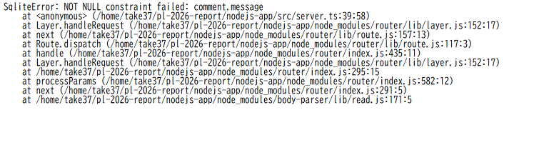

# 【課題C】 Webアプリ：Node.js vs. Yesod

## [Node.js](https://nodejs.org/ja)

Node.jsはJavascriptの実行する実行環境である。
特徴はJavascriptでも、サーバーサイドのプログラミングができる点である。
これにより、フロントエンドとサーバーサイドを同じ言語で記述できる。

また、Node.jsは頻繁に更新されている。2026年8月時点では、最新版はv26系であり、
長期サポート版であるLTS版は24系である。本レポートでは、LTS版を用いて開発を行った。

Node.jsでは、TypeScriptによって開発を行うこともできる。
TypeScriptはJavascriptに型システムが追加されたPLである。
プログラミングにおいて、Javascriptと異なる点はデータ型を明示的に宣言することができる点である。
これによって、データ型が一致しない場合や誤った使い方をした場合、TypeScriptはエラーによって間違いを実行前に知らせることができる。
しかし、必ずしもデータ型を明記する必要はない。データ型を記述しない場合は、文脈や値によって、データ型を指定する。さらに、TypeScriptがデータ型を推測しない場合、データ型は既定のany型となる。これは型検査を行わないデータ型である。
本レポートでは、TypeScriptを用いた。

また、expressというフレームワークを開発で用いた。
expressはNode.jsで実行可能なWebフレームワークである。
このフレームワークでは、各HTTPメソッドが関数として用意されているため、それに従ってプログラミングすることでwebアプリ開発を行うことができる。さらに、この関数の機能は、Typescritpの文脈依存の型推論を行うため、データ型をコンパイラが指定する。

### 具体例

以下は、本レポートで作成した掲示板アプリのコードの一部である。

トップページを表示する処理は次のようになっている。

```typescript
app.get("/", (req, res) => {
  const comments = db.prepare("SELECT * FROM comment ORDER BY id ASC").all();
  res.render("index", { comments });
});
```

`app.get`は Expressが提供する関数であり、第一引数の URL（`"/"`）にGETリクエストが来たときに、第二引数の関数を実行する。この関数の引数`req`（リクエスト）と`res`（レスポンス）にはデータ型を記述していない。しかし、`app.get`に渡す関数という文脈から、TypeScriptが`req`を`Request`型、`res`を`Response`型であると、文脈依存の型推論によって自動的に推論している。

投稿を受け取る処理は次のようになっている。

```typescript
app.post("/", (req, res) => {
  const message = req.body.message;
  if (message) {
    db.prepare("INSERT INTO comment (message) VALUES (?)").run(message);
  }
  res.redirect("/");
});
```

`"/"`にPOSTリクエストが来たとき、フォームで送信された内容を`req.body.message`として受け取り、データベースに保存している。ただし `req.body.message` の型は推論されず`any`型となる。このとき、値が存在するかどうかは `if (message)` によって自分で確認する必要がある。このように、Express と TypeScript の組み合わせでは、外部から送られてくる入力の妥当性は開発者が手動で検証しなければならない。


## [Yesod](https://www.yesodweb.com/)

YesodはHakellというPLによって、Webアプリを作成することができるフレームワークである。

Yesodでは、型安全性と表記の容易さの2点が挙げられる。
Hakellの型システムでは、外界とやり取りする場合計算効果をモナドという特殊なデータ型を使うことで表現している。これによって、DBとのやり取りやHTTPメソッド等にもデータ型を宣言することができる。

DBを操作したい場合、TypeScriptでは、SQLを書くことでDBを構築し、操作を行う。一方で、Yesodでは、簡単に宣言するだけで自動でDBが構築される。さらに、Yesodが与える関数を記述することで行うことができる。

さらに、この関数はDSLであるが、これもHakellで書かれているため、型検査の対象となる。すなわち、簡潔に書けるだけでなく、記述の誤りをコンパイル時に検出できる。


このように、型安全と簡潔さがYesodの特徴である。


### 具体例

型安全と簡潔さについて説明する。


データベースの構造は `config/models` に次のように記述する。

```
Comment
    message Text
    userId UserId Maybe
```

これによって、テーブルの作成とHaskellのデータ型であるCommentが自動的に生成される。

DBの操作は次のようにすることができる。

```haskell
getAllComments :: DB [Entity Comment]
getAllComments = selectList [] [Asc CommentId]
```

これもSQLではなくて関数を書くだけでよい。
また、これは、`DB [Entity Comment]`モナドによってデータ型が付く。

また、URLとルートの対応は、`config/routes`で記述する。

```
/ HomeR GET POST
```

この 1 行で、`/` というURLに `HomeR` という名前を与え、GET と POST を受け付けることを宣言している。ここで定義した `HomeR` はデータ型として扱われ、コードやテンプレートから参照できる。

```
<form method=post action=@{HomeR}>
```

`@{HomeR}` のように URL をデータ型として記述するため、存在しないルートを指定するとコンパイル時にエラーとなる。TypeScript 版では送信先を `action="/"` という文字列で記述したのに対し、Yesod では型として扱う点が異なる。


## Webアプリ例
コメントをひと言ずつ投稿することができる掲示板アプリを作成した。
このアプリは次の3つの機能から成る。

- フォームにメッセージを入力して投稿できる
- 投稿の一覧が表示される
- 投稿はデータベースに保存される

このアプリをNode.js/TypeScript 版と Yesod/Haskell 版で実装した。
### TyepScriptによるWebアプリ

前述のとおり、フレームワークはexpressを用いて作成した。

アプリの構成は次のようになっている

- 言語：TypeScript
- 実行環境：Node.js
- Web フレームワーク：Express
- テンプレート：EJS
- データベース：SQLite


次のコマンドで、実行することができる。

```
cd ~/pl-2026-report/nodejs-app
npx tsx src/server.ts
```


動作の流れは次のようになっている。利用者がページにアクセスすると、GET リクエストが送られる。サーバはこのリクエストを受け取り、データベースから投稿の一覧を取得して、ページに表示する。
利用者がフォームにメッセージを入力して送信すると、 POST リクエストが送られる。サーバはこのリクエストを受け取り、送信された内容をデータベースに保存する。これにより、新しい投稿が一覧に反映される。

### YesodによるWebアプリ

Yesod フレームワークを用いて、TypeScript 版と同じ機能の掲示板を作成した。アプリの構成は次のようになっている。

- 言語：Haskell
- Web フレームワーク：Yesod
- テンプレート：Hamlet
- データベース：SQLite

次のコマンドで開発サーバを起動できる。

​```
cd ~/pl-2026-report/yesod-app
stack exec -- yesod devel
​```

Yesod では、コードをコンパイルしてからアプリが起動する。ビルドが完了していない状態でアクセスすると、次のような待機画面が表示される。


ビルドが完了すると、次のような掲示板が表示される。


動作の流れは TypeScript 版と同様である。トップページ（`/`）への GET リクエストに対して `getHomeR` が呼ばれ、データベースから投稿一覧を取得してテンプレートで表示する。フォームからの投稿は `/` への POST リクエストとして送られ、`postHomeR` が呼ばれる。送信された内容をデータベースに保存し、トップページにリダイレクトすることで、新しい投稿が一覧に反映される。

なお、Yesod版はビルドに、コンパイルのため長い時間を要した。また、コードを変更するたびに再コンパイルが必要となる。一方 TypeScript版は`tsx`により即座に実行できた。


### Node.js/TypeScript vs. Yesod/Haskell


両方の方法で同じ掲示板を実装した。両者異なる点は、入力やDB、URLなどの外部とのやり取りの方法についてである。これらの違いについて考察する。


### 入力の扱い

TypeScriptでは、送られてきたメッセージが存在するかを `if` 文で自分で確認している。一方Yesodでは、フォームの入力結果をデータ型として扱う。したがって、TypeScriptではチェックを書き忘れても動いてしまい、誤りは実行時まで分からないのに対し、Yesodでは誤りをコンパイル時に検出できる。


TypeScript 版では、`message` を `mesage` と誤って記述しても、`req.body` の型が `any` であるためコンパイルは通り、プログラムは起動する。しかし実際に投稿を送信すると、次のように実行時エラーが発生する。



これはデータベースへの書き込み時に初めて検出されたエラーである。

一方 Yesod 版で、同様に関数名を `commentFormMessage` から `commentFormMesage` と誤って記述すると、ビルドの段階で次のエラーが出て、コンパイルが停止する。

```
Home.hs:34:44: error:
    • Variable not in scope: commentFormMesage :: CommentForm -> Text
    • Perhaps you meant 'commentFormMessage' (line 12)
```

このように Yesod では、誤りをコンパイル時に検出でき、さらに正しい候補（`commentFormMessage`）まで提示される。

この実験から、外部からの入力を扱う際、TypeScript では誤りが実行時までわからないことに対し、Yesod では型システムによって実行前に誤りを防げることが確認できた。

### データベースの扱い

データベースの操作にも、同様の違いが表れる。TypeScript 版では、SQL を文字列として記述する。

```typescript
db.prepare("SELECT * FROM comment ORDER BY id ASC").all();
```

この SQL は TypeScript にとって単なる文字列であり、テーブル名や列名を誤って記述しても、コンパイル時には検出されない。

一方 Yesod 版では、`config/models` の宣言から生成されたデータ型を用いて操作する。

```haskell
selectList [] [Asc CommentId]
```

`CommentId` はデータ型として扱われるため、存在しない列を指定すればコンパイル時にエラーとなる。すなわち、入力の場合と同様に、データベースとのやり取りという境界においても、Yesod は型によって誤りを実行前に防ぐ。


### URL の扱い

URL の指定にも同様の違いが見られる。TypeScript 版では、リンク先やフォームの送信先を文字列で記述する。

```typescript
res.redirect("/");
```

```html
<form method="post" action="/">
```

これらの文字列を誤って記述しても、コンパイル時には検出されず、リンク切れは実行時まで分からない。

一方 Yesod 版では、URL をデータ型として扱う。

```
<form method=post action=@{HomeR}>
```

`@{HomeR}` の `HomeR` は `config/routes` で定義したルートであり、存在しないルートを指定すればコンパイル時にエラーとなる。ここでも、外部であるブラウザとの境界が型によって守られている。


### まとめ

TypeScriptは実際の値に関しては、データ型を付けることができる。しかし、Haskelではこれに加えて外界との関わりである、計算効果にもデータ型を与えることができる。これによって、計算効果での誤りにたいして、Typescriptでは動かしてみないとわからないが、Yesodではビルドの時点で誤りを確認することができる。

しかし、Yesodではビルドしてから実際にページをみることができるまでにTypescriptに比べて時間がかかる。また、YesodのDSLは簡潔ではあるがSQLをそのまま書くことと比べると直感的ではない。

以上から、計算効果に対して安全である点は、TypescriptよりもむしろYesodが優れているといえる。また、Typescriptの方がデファクトスタンダードであることも安全であることよりもむしろ直感的さとjavascriptとの連携の良さに起因するといえる。


## 参考文献

- Node.js 公式：https://nodejs.org/ja
- Node.jsのイントロダクション:https://nodejs.org/learn/getting-started/introduction-to-nodejs
- Node.jsでのTypeScript:https://nodejs.org/learn/TypeScript/introduction
- TypeScriptにおける方推論:https://www.TypeScriptlang.org/docs/handbook/type-inference.html
- expressの説明:https://expressjs.com/ja/
- expressの具体例:https://expressjs.com/ja/5x/starter/hello-world/
- TypeScript any型:https://learn.microsoft.com/ja-jp/archive/msdn-magazine/2015/january/typescript-understanding-typescript
- Yesod 公式：https://www.yesodweb.com/
- Yesod 本:https://www.yesodweb.com/book
- Yesod イントロダクション:https://www.yesodweb.com/book/introduction


## ディレクトリ構成

本リポジトリの主要なファイル・ディレクトリは次の通りである。自動生成されるファイルやビルド成果物は省略している。

```
pl-2026-report/
├── README.md                          本レポート
├── images/                            レポートで使用した画像
├── nodejs-app/                        Node.js/TypeScript 版の掲示板
│   ├── src/
│   │   └── server.ts                  サーバの処理
│   ├── views/
│   │   └── index.ejs                  画面のテンプレート
│   ├── package.json                   依存ライブラリの定義
│   └── tsconfig.json                  TypeScript の設定
└── yesod-app/                         Yesod/Haskell 版の掲示板
    ├── src/
    │   └── Handler/
    │       └── Home.hs                トップページの処理
    ├── config/
    │   ├── models.persistentmodels    データベースの定義
    │   └── routes.yesodroutes         ルーティングの定義
    ├── templates/
    │   └── homepage.hamlet            画面のテンプレート
    └── package.yaml                   プロジェクトの定義
```


