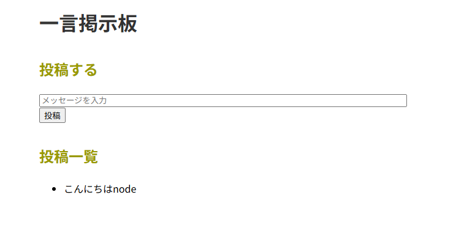
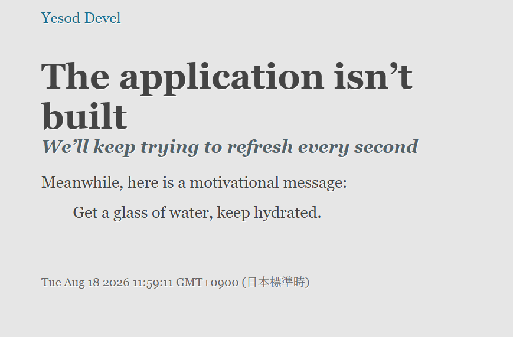
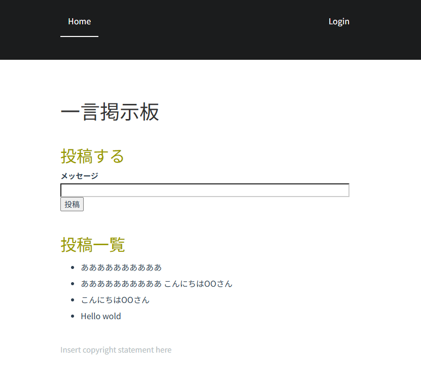

# 【課題C】 Webアプリ：Node.js vs. Yesod

## [Node.js](https://nodejs.org/ja)

Node.jsはJavascriptの実行する実行環境である。
特徴はJavascriptでも、サーバーサイドのプログラミングができる点である。
これにより、フロントエンドとサーバーサイドを同じ言語で記述できる。

また、Node.jsは頻繁に更新されている。2026年8月時点では、最新版はv26系であり、
長期サポート版であるLTS版は24系である。本レポートでは、LTS版を用いて開発を行った。

Node.jsでは、TypeScriptによって開発を行うこともできる。
TypeScriptはJavascriptに型システムが追加されたPLである。
プログラミングにおいて、Javascriptと異なる点はデータ型を明示的に宣言することができる点である。
これによって、データ型が一致しない場合や誤った使い方をした場合、TypeScriptはエラーによって間違いを実行前に知らせることができる。
しかし、必ずしもデータ型を明記する必要はない。データ型を記述しない場合は、文脈や値によって、データ型を指定する。
本レポートでは、TypeScriptを用いた。

また、expressというフレームワークを開発で用いた。
expressはNode.jsで実行可能なWebフレームワークである。
このフレームワークでは、各HTTPメソッドが関数として用意されているため、それに従ってプログラミングすることでwebアプリ開発を行うことができる。さらに、この関数の機能は、Typescritpの文脈依存の型推論を行うため、データ型をコンパイラが指定する。

### 具体例

以下は、本レポートで作成した掲示板アプリのコードの一部である。

トップページを表示する処理は次のようになっている。

```typescript
app.get("/", (req, res) => {
  const comments = db.prepare("SELECT * FROM comment ORDER BY id ASC").all();
  res.render("index", { comments });
});
```

`app.get` は Express が提供する関数であり、第一引数の URL（`"/"`）に GET リクエストが来たときに、第二引数の関数を実行する。この関数の引数 `req`（リクエスト）と `res`（レスポンス）には型注釈を記述していない。しかし、`app.get` に渡す関数という文脈から、TypeScript が `req` を `Request` 型、`res` を `Response` 型であると、文脈依存の型推論によって自動的に推論している。

投稿を受け取る処理は次のようになっている。

```typescript
app.post("/", (req, res) => {
  const message = req.body.message;
  if (message) {
    db.prepare("INSERT INTO comment (message) VALUES (?)").run(message);
  }
  res.redirect("/");
});
```

`"/"` に POST リクエストが来たとき、フォームで送信された内容を `req.body.message` として受け取り、データベースに保存している。ただし `req.body.message` の型は推論されず `any` 型となるため、値が存在するかどうかは `if (message)` によって自分で確認する必要がある。このように、Express と TypeScript の組み合わせでは、外部から送られてくる入力の妥当性は開発者が手動で検証しなければならない。


## [Yesod](https://www.yesodweb.com/)

YesodはHakellというPLによって、Webアプリを作成することができるフレームワークである。

Yesodでは、型安全性と表記の容易さの2点が挙げられる。
Hakellの型システムでは、外界とやり取りする場合計算効果をモナドという特殊な型を使うことで表現している。これによって、DBとのやり取りやHTTPメソッド等にもデータ型を宣言することができる。

DBを操作したい場合、TypeScriptでは、SQLを書くことでDBを構築し、操作を行う。一方で、Yesodでは、簡単に宣言するだけで自動でDBが構築される。さらに、Yesodが与える関数を記述することで行うことができる。

さらに、この関数はDSLであるが、これもHakellで書かれているため、型検査の対象となる。すなわち、簡潔に書けるだけでなく、記述の誤りをコンパイル時に検出できる。


このように、型安全と簡潔さがYesodの特徴である。


###　具体例

Yesodの特徴である。型安全と簡潔さについての具体例を説明する。


データベースの構造は `config/models` に次のように記述する。

```
Comment
    message Text
    userId UserId Maybe
```

これによって、テーブルの作成とHaskellのデータ型であるCommentが自動的に生成される。

DBの操作は次のようにすることができる。

```haskell
getAllComments :: DB [Entity Comment]
getAllComments = selectList [] [Asc CommentId]
```

これもSQLではなくて関数を書くだけでよい。
また、これは、`DB [Entity Comment]`モナドによって型が付く。

また、URLとルートの対応は、`config/routes`で記述する。

```
/ HomeR GET POST
```

この 1 行で、`/` というURLに `HomeR` という名前を与え、GET と POST を受け付けることを宣言している。ここで定義した `HomeR` は型として扱われ、コードやテンプレートから参照できる。

```
<form method=post action=@{HomeR}>
```

`@{HomeR}` のように URL を型として記述するため、存在しないルートを指定するとコンパイル時にエラーとなる（型安全 URL）。TypeScript 版では送信先を `action="/"` という文字列で記述したのに対し、Yesod では型として扱う点が異なる。


## Webアプリ例
コメントをひと言ずつ投稿することができる掲示板アプリを作成した。
このアプリは次の3つの機能から成る。

- フォームにメッセージを入力して投稿できる
- 投稿の一覧が表示される
- 投稿はデータベースに保存される

このアプリをNode.js/TypeScript 版と Yesod/Haskell 版で実装した。
### TyepScriptによるWebアプリ

前述のとおり、フレームワークはexpressを用いて作成した。

アプリの構成は次のようになっている

- 言語：TypeScript
- 実行環境：Node.js
- Web フレームワーク：Express
- テンプレート：EJS
- データベース：SQLite（better-sqlite3）


次のコマンドで、実行することができる。

```
cd ~/pl-2026-report/nodejs-app
npx tsx src/server.ts
```



動作の流れは次のようになっている。利用者がページにアクセスすると、GET リクエストが送られる。サーバはこのリクエストを受け取り、データベースから投稿の一覧を取得して、ページに表示する。
利用者がフォームにメッセージを入力して送信すると、 POST リクエストが送られる。サーバはこのリクエストを受け取り、送信された内容をデータベースに保存する。これにより、新しい投稿が一覧に反映される。

### YesodによるWebアプリ

Yesod フレームワークを用いて、TypeScript 版と同じ機能の掲示板を作成した。アプリの構成は次のようになっている。

- 言語：Haskell
- Web フレームワーク：Yesod
- テンプレート：Hamlet
- データベース：SQLite

次のコマンドで開発サーバを起動できる。

​```
cd ~/pl-2026-report/yesod-app
stack exec -- yesod devel
​```

Yesod では、コードをコンパイルしてからアプリが起動する。ビルドが完了していない状態でアクセスすると、次のような待機画面が表示される。



ビルドが完了すると、次のような掲示板が表示される。




動作の流れは TypeScript 版と同様である。トップページ（`/`）への GET リクエストに対して `getHomeR` が呼ばれ、データベースから投稿一覧を取得してテンプレート（Hamlet）で表示する。フォームからの投稿は `/` への POST リクエストとして送られ、`postHomeR` が呼ばれる。送信された内容をデータベースに保存し、トップページにリダイレクトすることで、新しい投稿が一覧に反映される。

なお、Yesod版は初回のビルドに、依存ライブラリのコンパイルのため長い時間を要した。また、コードを変更するたびに再コンパイルが必要となる。一方 TypeScript版は`tsx`により即座に実行できた。


### Node.js/TypeScript vs. Yesod/Haskell

（導入：同じ掲示板を両者で実装した。Webアプリは外部（利用者の入力・DB・URL）とやり取りするが、その「境界」の扱いに両者の違いが最もよく表れる）

両方の方法で同じ掲示板を実装した。両者異なる点は、入力やDB、URLなどの外部とのやり取りの方法についてである。これらの違いについて考察する。


### 入力の扱い
TypeScript では、送られてきたメッセージが存在するかを if 文で自分で確認している。一方 Yesod では、フォームの入力結果がデータ型として扱われ、成功・失敗の両方の処理を書かないとコンパイルが通らない。したがって、TypeScript ではチェックを書き忘れても動いてしまい、誤りは実行時まで分からないのに対し、Yesod では誤りをコンパイル時に検出できる。

例えば、

```
```


### データベースの扱い
（論点2：models由来の型 vs SQL文字列。コード例つき）

### URLの扱い
（論点3：@{HomeR} vs "/"。コード例つき）

### まとめ・評価
（3つに共通するのは「境界を型で守るYesod vs 文字列で扱うExpress」。評価：それぞれの利点・向き不向き）
## 参考文献

- Node.js 公式：https://nodejs.org/ja
- Node.jsのイントロダクション:https://nodejs.org/learn/getting-started/introduction-to-nodejs
- Node.jsでのTypeScript:https://nodejs.org/learn/TypeScript/introduction
- TypeScriptにおける方推論:https://www.TypeScriptlang.org/docs/handbook/type-inference.html
- expressの説明:https://expressjs.com/ja/
- expressの具体例:https://expressjs.com/ja/5x/starter/hello-world/
- Yesod 公式：https://www.yesodweb.com/
- Yesod 本:https://www.yesodweb.com/book
- Yesod イントロダクション:https://www.yesodweb.com/book/introduction


